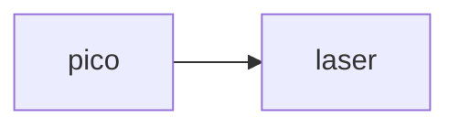

Создание устройства лазерной прослушки, которое будет ловить отраженный от стекла, зеркала, экрана, поверхности луч и преобразовывать его колебания, создаваемые колебаниями поверхности, обратно в звук.
Компоненты:
+ Лазерный модуль KY-008
+ Модуль для чтения microSD
+ Raspberry Pi Pico
+ Фотодиод BPW34
+ Усилитель

