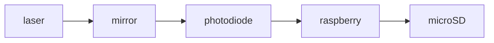

Создание устройства лазерной прослушки, которое будет ловить отраженный от стекла, зеркала, экрана, поверхности луч и преобразовывать его колебания, создаваемые колебаниями поверхности, обратно в звук.
Компоненты:
+ [Лазерный модуль KY-008](https://www.ozon.ru/product/lazernyy-modul-ky-008-arduino-1167219696/?at=mqtk7nEmZFBpPzkLhKq86jxtNJL9YWSEknzvpCkr27EB)
+ [Модуль для чтения microSD](https://www.ozon.ru/product/modul-kard-ridera-mini-sd-arduino-card-reader-arduino-2924415710/?at=79tn0k3OvcP1WYZMIywJ2nvTJ6AKqWToz2pwVcXGKy4E)
+ [Raspberry Pi Pico](https://www.ozon.ru/product/raspberry-pi-pico-w-mikrokontroller-4308204480/?at=16tL0Y1OnsmO5ZOvtplZ0xgc9kER8zTgYx662s20xKAB)
+ [Фотодиод BPW34](https://www.ozon.ru/product/fotodiod-bpw34-3533817735/?at=Y7tjvx105C6Xg8gGukRxy39IXBW8DJTyZ6jmmtVj7AVL)
+ Усилитель

